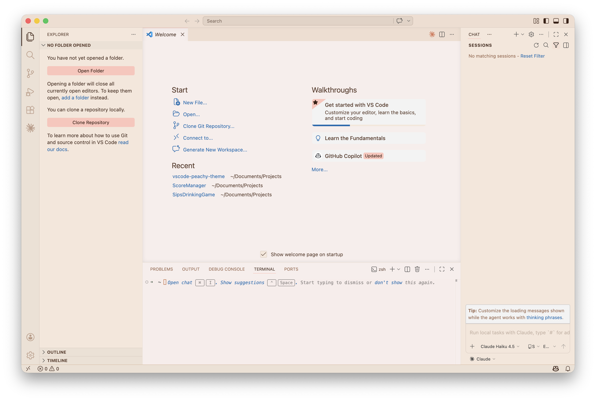

# 🍑 Peachy Theme

A warm, natural light theme for Visual Studio Code — built around soft **beige and linen tones** with **blush pink accents**. Designed to feel calm, chic, and easy on the eyes during long coding sessions.



---

## Palette

| Role | Color | Hex |
|---|---|---|
| Editor background |  Warm linen | `#F8EDEB` |
| Sidebar |  Soft sand | `#F5E6DA` |
| Activity bar |  Natural beige | `#EDE0D4` |
| Status bar |  Warm tan | `#E8CDB8` |
| Pink accent |  Blush | `#FEC5BB` |
| Text |  Dark espresso | `#4A2F22` |

---

## Installation

### From the `.vsix` file

1. Download `peachy-theme-1.0.0.vsix` from the [latest release](../../releases/latest)
2. Open VS Code → `Cmd+Shift+P` → **Extensions: Install from VSIX...**
3. Select the downloaded file
4. `Cmd+Shift+P` → **Color Theme** → choose **Peachy**

### Manual (dev)

```bash
git clone https://github.com/carolinejardimsiqueira/vscode-peachy-theme
cp -r vscode-peachy-theme ~/.vscode/extensions/carol.peachy-theme-1.0.0
```
Then reload VS Code and select the theme.

---

## Features

- **Light theme** — warm and soft, never harsh
- **Beige-first workspace** — the UI fades into the background so your code takes center stage
- **Pink as a highlight** — blush accents on active tabs, selections, focus borders, and badges
- **Semantic highlighting** — full support for classes, interfaces, functions, parameters, and more
- **Broad language support** — tuned for JS/TS, HTML/JSX, CSS, JSON, Markdown, and more

---

## License

[MIT](LICENSE) © 2026 Caroline Jardim Siqueira
